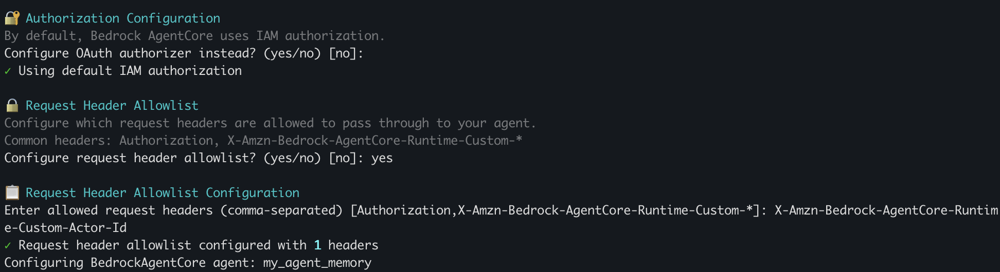

# Amazon Bedrock AgentCore Memory Lab

Add intelligent memory capabilities to AI agents with Amazon Bedrock AgentCore Memory.

## What is AgentCore Memory?

Amazon Bedrock AgentCore Memory is a fully managed service that gives your AI agents the ability to remember past interactions, enabling them to provide more intelligent, context-aware, and personalized conversations.

### AgentCore Services

- **[AgentCore Runtime](https://docs.aws.amazon.com/bedrock-agentcore/latest/devguide/runtime.html)** ⭐ - Serverless execution with auto-scaling and session management
- **[AgentCore Identity](https://docs.aws.amazon.com/bedrock-agentcore/latest/devguide/identity.html)** - Secure credential management for API keys and tokens  
- **[AgentCore Memory](https://docs.aws.amazon.com/bedrock-agentcore/latest/devguide/memory.html)** ⭐ - State persistence and conversation history
- **[AgentCore Code Interpreter](https://docs.aws.amazon.com/bedrock-agentcore/latest/devguide/code-interpreter-tool.html)** - Secure code execution sandbox
- **[AgentCore Browser](https://docs.aws.amazon.com/bedrock-agentcore/latest/devguide/browser-tool.html)** - Cloud browser automation
- **[AgentCore Gateway](https://docs.aws.amazon.com/bedrock-agentcore/latest/devguide/gateway.html)** - API management and tool discovery
- **[AgentCore Observability](https://docs.aws.amazon.com/bedrock-agentcore/latest/devguide/observability.html)** - Monitoring, tracing, and debugging
- **[AgentCore Policy](https://docs.aws.amazon.com/bedrock-agentcore/latest/devguide/policy.html)** - Deterministic control and security boundaries for agent-tool interactions
- **[AgentCore Evaluations](https://docs.aws.amazon.com/bedrock-agentcore/latest/devguide/evaluations.html)** - Automated assessment and performance measurement for agents

## This Lab: AgentCore Memory

This project demonstrates **AgentCore Memory** with two types of memory:

### Short-term Memory
Captures turn-by-turn interactions within a single session. Agents maintain immediate context without requiring users to repeat information.

### Long-term Memory
Automatically extracts and stores key insights from conversations across multiple sessions, including user preferences, important facts, and session summaries.

## Prerequisites

- [AWS Account](https://aws.amazon.com/account/?trk=87c4c426-cddf-4799-a299-273337552ad8&sc_channel=el) with [appropriate permissions](https://docs.aws.amazon.com/bedrock-agentcore/latest/devguide/runtime-permissions.html)
- Python 3.10+ installed
- [AWS CLI configured](https://docs.aws.amazon.com/cli/latest/userguide/getting-started-install.html)
- Basic understanding of [AI agents](https://aws.amazon.com/what-is/ai-agents/?trk=87c4c426-cddf-4799-a299-273337552ad8&sc_channel=el) and [AWS services](https://aws.amazon.com/what-is-aws/?trk=87c4c426-cddf-4799-a299-273337552ad8&sc_channel=el)

## Step 1: Navigate to Lab Directory

```bash
cd 02-agentcore-memory
```

## Step 2: Install Dependencies

```bash
pip install -r deployment/requirements.txt
```

## Step 3: Configure the Agent

Navigate to the deployment directory and configure the agent:

```bash
cd deployment
```

Configure the agent with memory enabled:

```bash
agentcore configure -e my_agent_memory.py
# Select 'yes' for memory
# Select 'yes' for long-term memory extraction
```

### Custom Header Configuration

Select YES in *Request Header Allow list*, and in *Request Header Allow* paste  `X-Amzn-Bedrock-AgentCore-Runtime-Custom-Actor-Id`




At the end `.bedrock_agentcore.yaml`, must looks like this: 

```yaml
request_header_configuration:
  requestHeaderAllowlist:
  - X-Amzn-Bedrock-AgentCore-Runtime-Custom-Actor-Id
```

This header allows passing a user identifier from your application to the agent. The agent extracts it from `context.request_headers` (normalized to lowercase: `x-amzn-bedrock-agentcore-runtime-custom-actor-id`) and uses it to namespace memory per user.

## Step 4: Deploy to Production

Launch the agent to production:

```bash
agentcore launch
```

## Step 5: Test Memory Functionality

Use the `agentcore invoke` CLI command to test memory capabilities. The CLI supports `--session-id` and `--headers` flags for testing different memory scenarios.

**Important:** Session IDs must be at least 33 characters long.

### Test Short-term Memory (within session)

Store information in a session:

```bash
agentcore invoke '{"prompt": "My name is Laura and I love banana"}' \
  --session-id session1-laura-test-12345678901234 
```

Recall information in the same session:

```bash
agentcore invoke '{"prompt": "What is my name and what do I love?"}' \
  --session-id session1-laura-test-12345678901234 
```

### Test Long-term Memory (across sessions)

Store preferences in session 1:

```bash
agentcore invoke '{"prompt": "I prefer vegetarian food and work as a teacher"}' \
  --session-id session1-user456-test-1234567890123 \
  --headers "X-Amzn-Bedrock-AgentCore-Runtime-Custom-Actor-Id:user456"
```

**Important:** Long-term memory extraction is an [asynchronous background process](https://docs.aws.amazon.com/bedrock-agentcore/latest/devguide/long-term-saving-and-retrieving-insights.html#long-term-step-2-retrieve-extracted-insights) that can take a minute or more. Wait at least a few minutes before testing recall in a different session:

```bash
agentcore invoke '{"prompt": "What do you know about my food preferences and job?"}' \
  --session-id session2-user456-test-9876543210987 \
  --headers "X-Amzn-Bedrock-AgentCore-Runtime-Custom-Actor-Id:user456"
```

**Key Points:**
- Session IDs must be at least 33 characters long
- Short-term memory works within a single session without needing the actor ID header
- Long-term memory requires the custom header to identify users across different sessions
- Long-term memory extraction is an [asynchronous process](https://docs.aws.amazon.com/bedrock-agentcore/latest/devguide/long-term-saving-and-retrieving-insights.html#long-term-step-2-retrieve-extracted-insights) that can take a minute or more
- Same custom header value enables cross-session memory for that user

>The tests use the AWS SDK to call `bedrock-agentcore:InvokeAgentRuntime`, requiring your agent ARN and appropriate permissions.

## Step 6: Understanding Memory Configuration

The agent uses [AgentCore Memory SDK](https://github.com/aws/bedrock-agentcore-sdk-python/tree/main/src/bedrock_agentcore/memory) for integration with Strands Agents.

### Automatic Memory Setup

When you run `agentcore configure` and enable memory, the AgentCore CLI automatically creates the memory resource (if needed) and sets the `BEDROCK_AGENTCORE_MEMORY_ID` environment variable during `agentcore launch`. Your agent code reads this variable automatically - no manual configuration needed.

### Basic Memory Setup
```python
from bedrock_agentcore.memory import MemoryClient
from bedrock_agentcore.memory.integrations.strands.config import AgentCoreMemoryConfig, RetrievalConfig

# HTTP headers are normalized to lowercase
CUSTOM_HEADER_NAME = 'x-amzn-bedrock-agentcore-runtime-custom-actor-id'

# Create memory client
client = MemoryClient(region_name="us-west-2") #your region

# Create memory store
basic_memory = client.create_memory(
    name="BasicTestMemory",
    description="Basic memory for testing short-term functionality"
)

# Configure memory with retrieval settings
memory_config = AgentCoreMemoryConfig(
    memory_id=basic_memory.get('id'),
    session_id=session_id,
    actor_id=actor_id,
    retrieval_config={
        f"/users/{actor_id}/facts": RetrievalConfig(top_k=3, relevance_score=0.5),
        f"/users/{actor_id}/preferences": RetrievalConfig(top_k=3, relevance_score=0.5)
    }
)
```

### Memory Integration with Strands Agents
```python
from bedrock_agentcore.memory.integrations.strands.session_manager import AgentCoreMemorySessionManager

# Create agent with memory
agent = Agent(
    session_manager=AgentCoreMemorySessionManager(memory_config, REGION),
    system_prompt="You are a helpful assistant with memory. Remember user preferences and facts across conversations."
)
```

## Step 7: Understanding the Agent Code

The `invoke` function is the main entry point for your AgentCore agent. It:

- Receives user prompts and context from AgentCore Runtime
- Extracts the custom header for user identification (normalized to lowercase)
- Creates or retrieves the agent instance with memory configuration
- Processes the user message and returns the response

```python
@app.entrypoint
def invoke(payload, context: RequestContext):
    """AgentCore Runtime entry point with lazy-loaded agent"""
    if not MEMORY_ID:
        return {"error": "Memory not configured. Set BEDROCK_AGENTCORE_MEMORY_ID environment variable."}

    # Extract custom header and session information
    actor_id = 'default-user'
    if context and hasattr(context, 'request_headers') and context.request_headers:
        # Headers are normalized to lowercase
        actor_id = context.request_headers.get(CUSTOM_HEADER_NAME)
    
    session_id = context.session_id
    
    # Get or create agent (lazy loading)
    agent = get_or_create_agent(actor_id, session_id)
    
    prompt = payload.get("prompt", "Hello!")
    result = agent(prompt)
    
    return {
        "response": result.message.get('content', [{}])[0].get('text', str(result))
    }
```

## Step 8: Test Memory with Python Applications (Optional)

For more comprehensive testing, you can use the provided test applications that demonstrate both short-term and long-term memory capabilities.

### Test Short-term Memory

Use the `test_short_memory.py` application to test memory within the same session:

```bash
# Set your agent ARN (get from agentcore status)
export AGENT_ARN="YOUR-ARN"

# Run the short-term memory test
python test_short_memory.py
```

This script will test:
- Information storage within a session
- Memory recall in the same session
- Session-based context retention

### Test Long-term Memory

Use the `test_long_memory.py` application to test memory persistence across different sessions:

```bash
# Set your agent ARN (get from agentcore status)
export AGENT_ARN="YOUR-ARN"

# Run the long-term memory test
python test_long_memory.py
```

This script will test:
- Information storage in one session
- Memory extraction and persistence
- Cross-session memory recall
- User-specific memory isolation

**Note:** Long-term memory extraction is an [asynchronous background process](https://docs.aws.amazon.com/bedrock-agentcore/latest/devguide/long-term-saving-and-retrieving-insights.html#long-term-step-2-retrieve-extracted-insights) that can take a minute or more. The test waits 10 seconds between invocations, but for reliable long-term memory retrieval, you may need to wait longer or run the second session separately after a few minutes.

**Key Points for Memory Testing:**
- **Agent ARN**: Get this from `agentcore status` output
- **Session IDs**: Must be 33+ characters for proper session management
- **Custom Headers**: Use boto3 event handlers with `X-Amzn-Bedrock-AgentCore-Runtime-Custom-Actor-Id` for user-specific memory
- **Long-term Memory Extraction**: An [asynchronous background process](https://docs.aws.amazon.com/bedrock-agentcore/latest/devguide/long-term-saving-and-retrieving-insights.html#long-term-step-2-retrieve-extracted-insights) that can take a minute or more. For testing, wait a few minutes between storing and retrieving long-term memories

## Step 9: Clean Up

```bash
agentcore destroy
```

## Resources

### Documentation
- [What is Amazon Bedrock AgentCore?](https://docs.aws.amazon.com/bedrock-agentcore/latest/devguide/what-is-bedrock-agentcore.html)
- [AgentCore Memory SDK](https://github.com/aws/bedrock-agentcore-sdk-python/tree/main/src/bedrock_agentcore/memory)
- [AgentCore Memory Guide](https://docs.aws.amazon.com/bedrock-agentcore/latest/devguide/memory.html)
- [Programmatic Agent Invocation](https://docs.aws.amazon.com/bedrock-agentcore/latest/devguide/runtime-get-started-toolkit.html#invoke-programmatically)

### Code Examples
- [AWS Labs AgentCore Samples](https://github.com/awslabs/amazon-bedrock-agentcore-samples/)